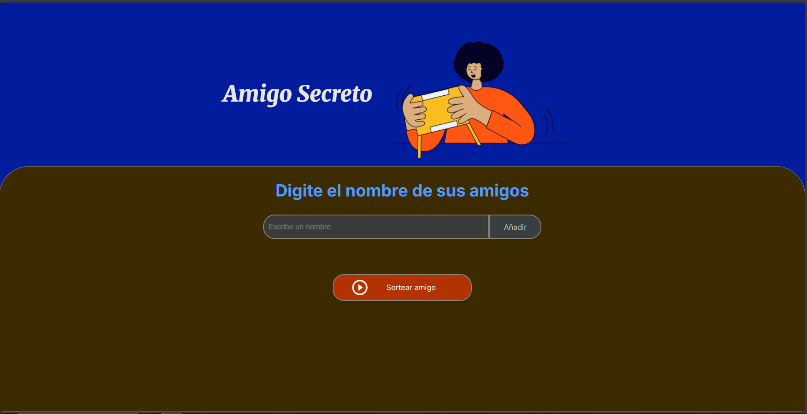

Amigo Secreto

Este es un proyecto web simple para gestionar un juego de "Amigo Secreto".  
Permite ingresar nombres de amigos, visualizarlos en una lista y sortear uno aleatoriamente.

Características
- Agregar nombres a una lista.
- Evita nombres duplicados o vacíos.
- Mostrar la lista de amigos en tiempo real.
- Sortear un amigo aleatorio.
- Interfaz simple y fácil de usar.

Tecnologías utilizadas
- HTML = Estructura de la página.
- CSS =  Estilos y diseño visual.
- JavaScript = Lógica de interacción y manipulación del DOM.

Notas técnicas
- En la versión actual del proyecto se utiliza un bucle for dentro de la función actualizarLista() para recorrer el arreglo listaAmigos y generar dinámicamente un elemento <li> por cada nombre.
- En los comentarios del código está documentada una posible alternativa usando if.
- Esa condición no reemplaza al bucle, sino que sirve para verificar que el arreglo no esté vacío antes de hacer el sorteo o intentar mostrar los elementos

Cómo usar
1. Abre `index.html` en tu navegador.
2. Escribe el nombre de un amigo en el campo de texto.
3. Presiona el botón "Añadir" para agregarlo a la lista.
4. Cuando tengas todos los nombres, presiona "Sortear amigo".
5. El nombre sorteado aparecerá en la sección de resultados.

   

Proyecto pensado como práctica para manipulación de DOM y eventos en JavaScript.
